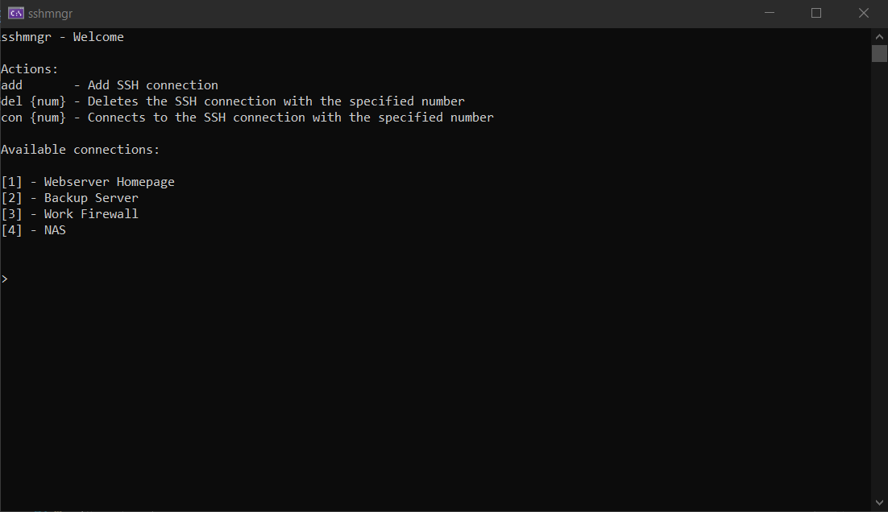

# sshmngr

sshmngr is a minimalistic ssh connection manager. It lets you manage your SSH connections and provides quick access to them. It saves a its data to `~/.sshmngr/connections.json`.

## Installation

Download the binary from the GitHub Releases. Extract them to a folder of your choice and add it to your PATH.

## Development

Requirements:

- NET 6 SDK

For development and debugging I recommend Visual Studio 2022. To create a release build use the `build.[sh|bat]` script in the root directory.
